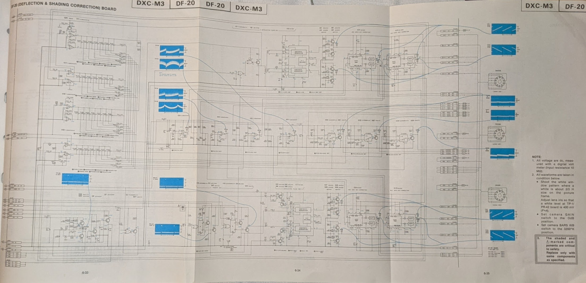
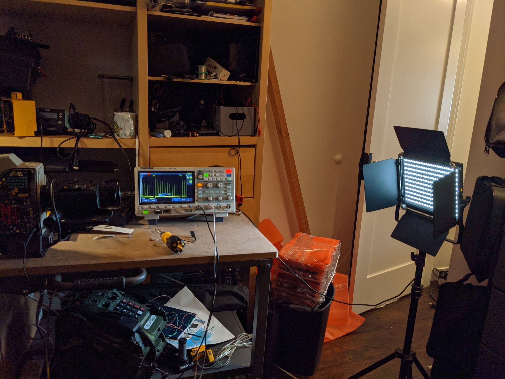
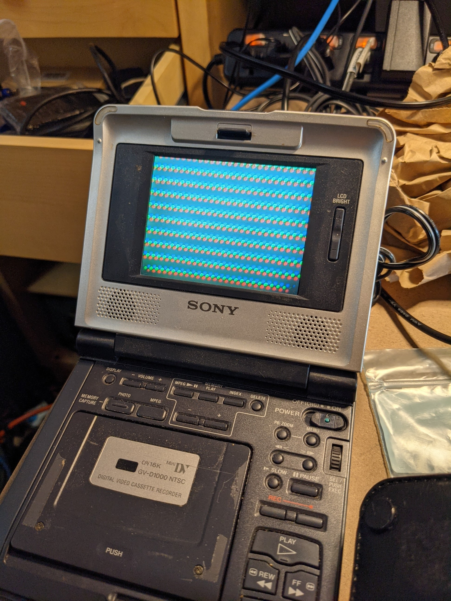
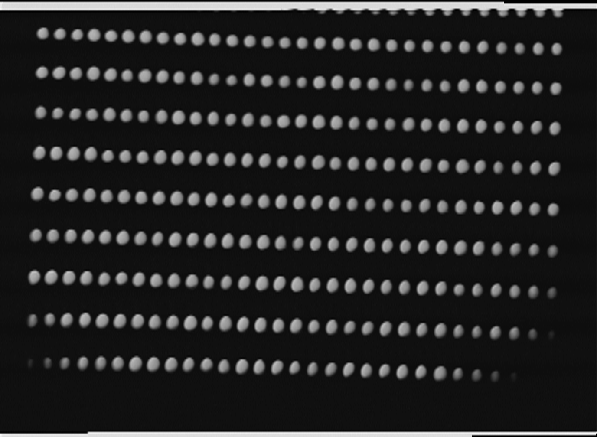
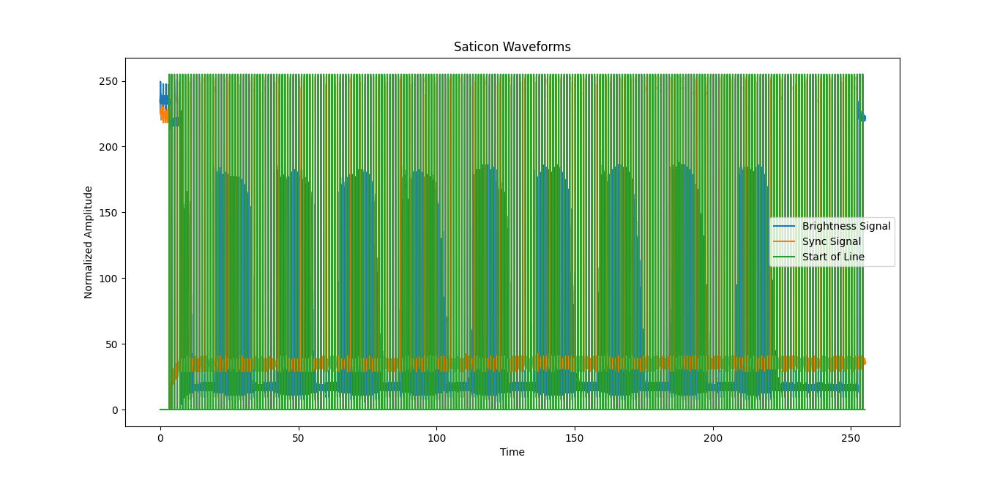
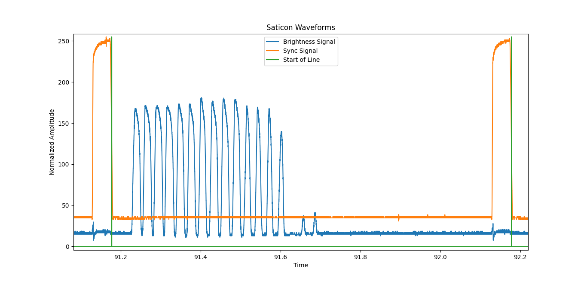

# Saticon
This is a Python script which decodes the raw output from a Sony DXC-M3 <a href="https://en.wikipedia.org/wiki/Video_camera_tube">Saticon</a> tube based video camera. I probed it as close to the output of the tube as I could (possibly after the first amplifier), and the script takes this raw signal plus the camera's sync signal and composes an image from it. The camea outputs <a href="https://en.wikipedia.org/wiki/480i">480i</a> interlaced video, so this cheats and resizes a single frame.

This camera is a marvel of 1980's hardware engineering: the signal path is obvious and most parts are analog. It also has a full repair manual with schematics, layout, and reference oscilloscope captures:

<h2>Setup</h2>

Since I probed very early on in the signal chain before much gain had been added, it took a pretty bright input to produce a discernable response on the scope. The input we used was an LED studio light:

This camera was a bit screwed up and had clearly been dropped in the past. As a result, the RGB channels (oh, yes: saticon tubes are monochromatic, so the camera has three with a prism and filters) are rather misaligned:

Here's the overall setup:

<h2>Decoding</h2>

I didn't do any research on analog video before writing this code up while on an airplane, but I did come in with some background knowledge. I captured the aplitude and sync waveforms using my Siglent SDS1104 oscilloscope set to 5M sample depth. A 640x480 interlaced video half frame (ignoring the vertical blanking interval) has 640*240=153k pikels, so 5M sample depth is sufficient oversampling to capture everything. I could have captured two 240-line half-frames to reconstitute a 480-line frame, but I wasn't considering that the video may be interlaced at the time I took the oscilloscope captures.

My code first finds the start of lines to determine how long a line is. Is then scans back through the data to sample pixels. I chose a 2x oversampling since the tube output is inherantly analog and effectively does the linear interpolation for you. The last step resizes the image to compensate for this being one half-frame of interlaced video and for oversampling on the x-axis.

Here's the decoded image:

Here's what a full frame of raw input looks like:

And here's what a single line of raw input looks like:

<h2>Disclaimer</h2>

This is hobbyist Python code from an electrical engineer. It is by no means efficient nor is it to be taken as the 'right' way of doing this. Many people fear airing hobby work for fear that they will be judged for it, but I think that deprives the world of good-enough working examples.

To get this to work, you need to unpack the scope capture binary "SDS0001.bin" using the included sketchy Chinese binary "FileConverter.zip" You then need to fix the headers of the resultant CSV. I would have included that CSV directly, but it is more than 100 MB becuse an ASCII CVS is a terible way of storing binary samples.

